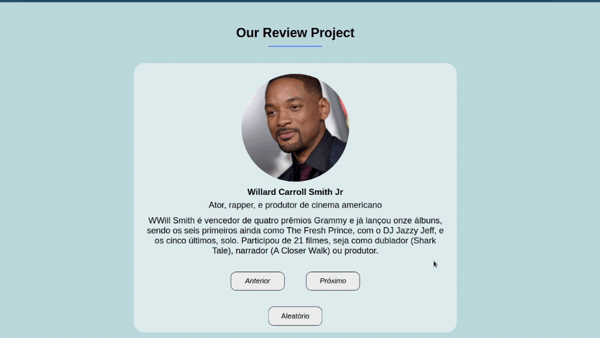

# Carrossel de Revisões

## Sobre o projeto:

Este projeto foi criado com JavaScript, é um carrossel de classificação com um botão que gera classificações aleatórias.

Este é um bom recurso para ter em um site de comércio eletrônico para exibir avaliações de clientes ou um portfólio pessoal para exibir avaliações de clientes.

## Funcionamento do projeto:

  

## Conceitos tratados:

- Objects;
- DOMCentLoaded;
- AddEventListener();
- Array.length;
- TextContent;
